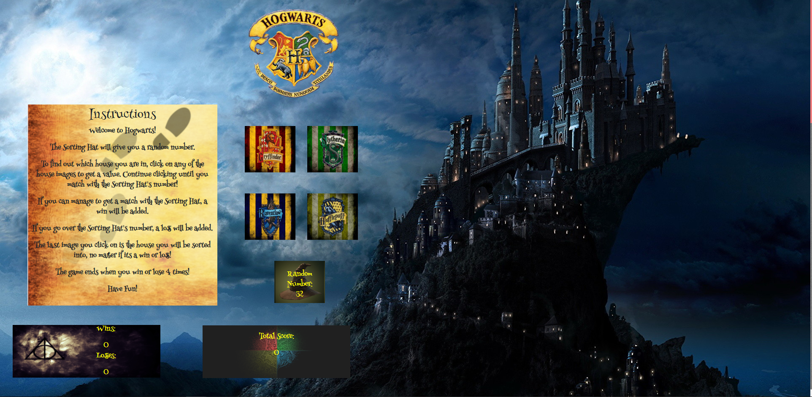

# **House of Hogwarts**
Can you guess the number the Sorting Hat is thinking of and be allowed admittance to Hogwarts?  Play House of Hogwarts to find out!
## **Overview**
This app is a simple click based game that has the user try and guess the choosen number.  The user will be able to click on four different images, all with random values assigned to them.  The user will try to add up the value of the images to the choosen number. If the user chooses the right number, a win will be added to the win column, and if the user runs out of guesses, a loss will be added to the lose column.  The game will continue until the user gains 5 wins in the win column or 5 losses in the loss column.  

## **Link To App**
https://blnicholson.github.io/Unit-4-game
## **Technical Information**
This app was created by using the following:

* JavaScript
* HTML
* CSS
* jQuery

